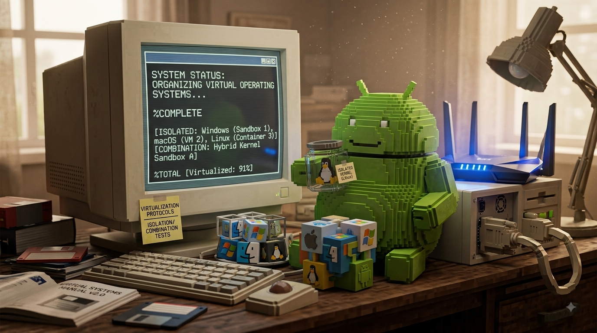

# Ultra-Compiler 🚀📦🔗📱

<p align="center">
  
</p>

<p align="center">
  
  
  
  
  
  
</p>

---

## 🌟 What is this?
**Ultra-Compiler** is a powerful multi-language compilation and packaging pipeline. It takes code written in various programming languages and translates it into production-ready software packages, including native Android apps (`.apk`), WebAssembly shells, and native binaries.

---

## ⚙️ What this does?
* **Parses Multiple Languages:** Analyzes source code files across Python, C/C++, Java, and JavaScript using dedicated front-end parsers.
* **Intermediate Representation (IR):** Converts code into a unified LLVM/Wasm intermediate representation for cross-platform compatibility.
* **Cross-Compilation:** Compiles code specifically for target CPU architectures and runtime targets (like ARM64 or DEX bytecode).
* **Automated Packaging:** Bundles outputs into ready-to-deploy formats such as Android `.apk` files, Wasm web shells, or native executables.

---

## 🔄 How does this work?
1. **Frontend Stage:** Input files are processed by language-specific parsers to build a universal AST.
2. **IR Core Stage:** The AST is optimized and transformed into LLVM IR or WebAssembly text format.
3. **Backend Stage:** Binaries are generated utilizing native toolchains like Clang, Android NDK, and DEX generators.
4. **Packager Stage:** Automated build tools (`aapt2`) package the final assets into deployable applications.

---

## 🛠️ Project Tech Stack
* **Core Logic:** Python 3.10+
* **Containerization:** Docker & Docker Compose
* **CI/CD Automation:** GitHub Actions
* **Android Framework:** Android SDK, NDK, Java/Kotlin, Gradle (`build.gradle.kts`, `AndroidManifest.xml`)
* **Languages & Runtimes:** C/C++, Go mobile shells, WebAssembly (Wasm), and JavaScript

---

## 🚀 How to Install and Use

### Local Execution
1. Clone the repository:
   ```bash
   git clone [https://github.com/darnellwashingtonjr94-art/Ultra-Compiler.git](https://github.com/darnellwashingtonjr94-art/Ultra-Compiler.git)
   cd Ultra-Compiler
